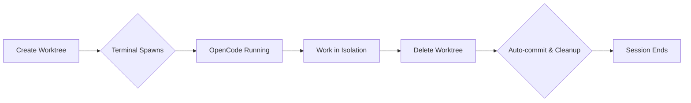

# opencode-worktree

> Git worktrees that spawn their own terminal. Zero-friction isolation for AI-driven development.

An [OpenCode](https://github.com/sst/opencode) plugin that creates isolated git worktrees—where each worktree automatically opens its own terminal with OpenCode running inside. No manual setup, no context switching, no cleanup work.

## Why This Exists

You already know you can create git worktrees manually. Or use OpenCode Desktop's UI. So why this plugin?

Manual worktrees require setup: create the worktree, open a terminal, navigate to it, start OpenCode. OpenCode Desktop gives you worktrees, but locks you into the GUI workflow. Each approach has friction.

This plugin eliminates that friction. When the AI calls `worktree_create`, your terminal spawns automatically, OpenCode is already running, and files are synchronized. When it calls `worktree_delete`, changes commit automatically and the worktree cleans itself up. It's the difference between having a tool and having a workflow.

Works great standalone, but pairs especially well with **tmux** for seamless window management. When running inside tmux, worktrees spawn as new windows instead of separate terminal apps—keeping everything organized in a single terminal session with zero external window overhead.

## When to Use This

| Approach | Best For | Tradeoffs |
|----------|----------|-----------|
| **Manual git worktree** | One-off experiments, full control | Manual setup, no auto-cleanup, context switching |
| **OpenCode Desktop UI** | Visual workflow, integrated experience | Tied to desktop app, less automation |
| **This plugin** | AI-driven workflows, automation, CLI-first users | Adds plugin dependency to your project |

If you prefer manual control or work exclusively in OpenCode Desktop, you may not need this. **But if you want AI agents to seamlessly create and manage isolated development sessions—complete with automatic terminal spawning and state cleanup—this is what you're looking for.**

## How It Works



1. **Create** - AI calls `worktree_create("feature/dark-mode")`
2. **Terminal spawns** - New window opens with OpenCode at `~/.local/share/opencode/worktree/<project-id>/feature/dark-mode`
3. **Work** - AI experiments in complete isolation
4. **Delete** - AI calls `worktree_delete("reason")`
5. **Cleanup** - Changes commit automatically, git worktree removed

Worktrees are stored in `~/.local/share/opencode/worktree/<project-id>/<branch>/` outside your repository.

## Installation

Install via [OCX](https://github.com/kdcokenny/ocx), the package manager for OpenCode extensions:

```bash
# Install OCX
curl -fsSL https://ocx.kdco.dev/install.sh | sh

# Add the registry and install
ocx registry add --name kdco https://registry.kdco.dev
ocx add kdco/worktree
```

Want the full experience? Install `kdco-workspace` instead—it bundles worktrees with background agents, planning tools, and notifications:

```bash
ocx add kdco/workspace
```

## Usage

The plugin adds two tools:

| Tool | Purpose |
|------|---------|
| `worktree_create(branch, baseBranch?)` | Create a new git worktree for isolated development. A new terminal spawns with OpenCode ready. |
| `worktree_delete(reason)` | Delete the current worktree. Changes commit automatically before removal. |

### Creating a Worktree

```yaml
worktree_create:
  branch: "feature/dark-mode"
  baseBranch: "main"  # optional, defaults to HEAD
```

When called, this:
1. Creates git worktree at `~/.local/share/opencode/worktree/<project-id>/feature/dark-mode`
2. Syncs files based on `.opencode/worktree.jsonc` config
3. Runs post-create hooks (e.g., `pnpm install`)
4. Opens a new terminal with OpenCode running

### Deleting a Worktree

```yaml
worktree_delete:
  reason: "Feature complete, merging to main"
```

When called, this:
1. Runs pre-delete hooks (e.g., `docker compose down`)
2. Commits all changes with snapshot message
3. Removes git worktree with `--force`
4. Cleans up session state

## Platform Support

The plugin detects your terminal automatically:

| Platform | Terminals Supported |
|----------|---------------------|
| **macOS** | Ghostty, iTerm2, Kitty, WezTerm, Alacritty, Warp, Terminal.app |
| **Linux** | Kitty, WezTerm, Alacritty, Ghostty, Foot, GNOME Terminal, Konsole, XFCE4 Terminal, xterm |
| **Windows** | Windows Terminal (wt.exe), cmd.exe fallback |
| **tmux** | **Creates new tmux window** (priority detection on all platforms) |
| **WSL** | Windows Terminal via wt.exe interop |

### Detection Priority

1. **tmux** - **Priority detection on all platforms** - Creates new tmux windows instead of spawning separate terminal applications. This keeps all worktrees organized in a single terminal session with native tmux window management and zero external window overhead.
2. **WSL** - Uses Windows Terminal for Linux subsystem
3. **Environment vars** - Checks `TERM_PROGRAM`, `KITTY_WINDOW_ID`, `GHOSTTY_RESOURCES_DIR`, etc.
4. **Fallback** - System defaults (Terminal.app, xterm, cmd.exe)

## Configuration

Auto-creates `.opencode/worktree.jsonc` on first use:

```jsonc
{
  "$schema": "https://registry.kdco.dev/schemas/worktree.json",

  "sync": {
    // Files to copy from main worktree
    "copyFiles": [],

    // Directories to symlink
    "symlinkDirs": [],

    // Patterns to exclude
    "exclude": []
  },

  "hooks": {
    // Run after creation
    "postCreate": [],

    // Run before deletion
    "preDelete": []
  }
}
```

### Common Configurations

**Node.js project:**
```jsonc
{
  "sync": {
    "copyFiles": [".env", ".env.local"],
    "symlinkDirs": ["node_modules"]
  },
  "hooks": {
    "postCreate": ["pnpm install"]
  }
}
```

**Docker-based project:**
```jsonc
{
  "sync": {
    "copyFiles": [".env"]
  },
  "hooks": {
    "postCreate": ["docker compose up -d"],
    "preDelete": ["docker compose down"]
  }
}
```

## FAQ

### Why not just use git worktree manually?

Manual worktrees require manual setup: `git worktree add`, opening a terminal, navigating to it, starting OpenCode. Each step is friction. This plugin gives you a single command that handles everything end-to-end, complete with automatic file synchronization and lifecycle hooks.

### Does this work with OpenCode Desktop?

Worktrees created with this plugin work fine in OpenCode Desktop, but you lose the automatic terminal spawning. The plugin's value is in CLI-first workflows and AI automation—if you prefer Desktop exclusively, you may not need this.

### What happens if I forget to delete the worktree?

Changes remain in `~/.local/share/opencode/worktree/<project-id>/<branch>`. The branch exists in git. You can manually check out or delete it later. The plugin doesn't force cleanup—it's just the convenient default path.

### Can I have multiple worktrees simultaneously?

Yes. Each gets its own terminal and OpenCode session. They're fully independent.

### Does this break my existing git workflow?

No. It uses standard git worktrees. `git worktree list` shows them. Branches merge normally.

### Why spawn a new terminal instead of reusing the current one?

Isolation. You can close the worktree session without affecting your main workflow. If the AI breaks something, your original terminal remains untouched.

## Limitations

### Security

- Branch names validated against git ref rules and shell metacharacters
- File sync paths validated to prevent directory traversal
- Hook commands run with user privileges in worktree directory

### Terminal Spawning

- Ghostty on macOS uses inline commands to avoid permission dialogs
- Kitty tab support requires `allow_remote_control` config (falls back to window)
- Some terminals don't support tabs; opens new OS window instead

## Manual Installation

Copy [`src/`](./src) to `.opencode/plugin/`. You lose OCX's dependency management and automatic updates.

**Requirements:**
- Manually install `jsonc-parser`
- Manual updates via re-copying

## Part of the OCX Ecosystem

From the [KDCO Registry](https://github.com/kdcokenny/ocx/tree/main/registry/src/kdco). Combine with:

- [opencode-workspace](https://github.com/kdcokenny/opencode-workspace) - Structured planning with rule injection
- [opencode-background-agents](https://github.com/kdcokenny/opencode-background-agents) - Async delegation with persistent outputs
- [opencode-notify](https://github.com/kdcokenny/opencode-notify) - Native OS notifications

## Acknowledgments

Inspired by [opencode-worktree-session](https://github.com/felixAnhalt/opencode-worktree-session) by Felix Anhalt.

## Disclaimer

This project is not built by the OpenCode team and is not affiliated with [OpenCode](https://github.com/sst/opencode) in any way.

## License

MIT
